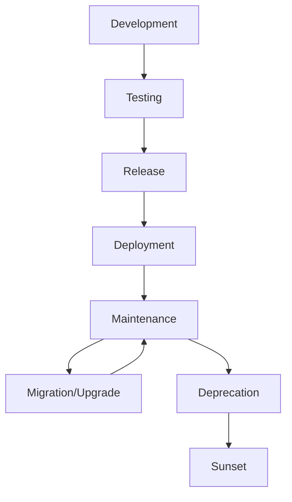

# Plugin Lifecycle and Migration Guide

This guide covers the complete lifecycle of FileOperations plugins, from development to deployment, maintenance, and migration between versions.

## Table of Contents

1. [Plugin Lifecycle Overview](#plugin-lifecycle-overview)
2. [Development Phase](#development-phase)
3. [Testing Phase](#testing-phase)
4. [Release Phase](#release-phase)
5. [Deployment Phase](#deployment-phase)
6. [Maintenance Phase](#maintenance-phase)
7. [Migration Strategies](#migration-strategies)
8. [Versioning Guidelines](#versioning-guidelines)
9. [Deprecation Process](#deprecation-process)
10. [Best Practices](#best-practices)

## Plugin Lifecycle Overview

The plugin lifecycle consists of several distinct phases:



### Lifecycle Phases

1. **Development**: Plugin creation, feature implementation, and initial testing
2. **Testing**: Comprehensive validation, performance testing, and quality assurance
3. **Release**: Version tagging, documentation, and package publishing
4. **Deployment**: Installation, configuration, and integration with existing systems
5. **Maintenance**: Bug fixes, security updates, and minor improvements
6. **Migration**: Version upgrades, breaking changes, and compatibility management
7. **Deprecation**: End-of-life planning and user migration
8. **Sunset**: Final removal and cleanup

## Development Phase

### 1. Planning and Design

Before starting development, plan your plugin thoroughly:

```typescript
// Example planning checklist
const pluginPlan = {
  target: {
    languages: ['rust', 'go'], // Languages to support
    features: ['parsing', 'diagnostics', 'formatting'], // Capabilities
    performance: { maxFileSize: '5MB', parseTime: '<100ms' } // Requirements
  },
  
  architecture: {
    parsingStrategy: 'tree-sitter', // tree-sitter, regex, or language-server
    dependencies: ['tree-sitter-rust'], // External dependencies
    caching: true, // Enable caching
    incremental: true // Support incremental parsing
  },
  
  compatibility: {
    coreVersion: '^1.0.0', // Minimum core version
    platforms: ['node', 'web'], // Target platforms
    breaking: false // Breaking changes from previous version
  }
};
```

### 2. Scaffolding

Use the Plugin CLI to create your plugin structure:

```bash
# Create a new plugin
npx gemini-cli-plugin create \
  --name "Rust Language Plugin" \
  --id "rust-language-plugin" \
  --languages rust \
  --extensions .rs,.rlib \
  --template tree-sitter \
  --output ./my-plugins

# Or use interactive mode
npx gemini-cli-plugin interactive
```

### 3. Implementation Guidelines

Follow these guidelines during implementation:

#### Core Implementation
```typescript
export class RustPlugin extends BaseLanguagePlugin {
  // Always implement required methods
  getMetadata(): PluginMetadata { /* ... */ }
  async parse(content: string, filePath: string): Promise<ParseResult> { /* ... */ }
  
  // Add lifecycle hooks
  protected async onInitialize(config: PluginConfiguration): Promise<void> {
    // Initialize resources (parsers, connections, etc.)
    await this.initializeTreeSitter();
  }
  
  protected async onCleanup(): Promise<void> {
    // Clean up resources
    this.treeParser?.delete();
  }
  
  // Custom validation
  protected async onValidate(result: PluginValidationResult): Promise<void> {
    // Add plugin-specific validation
    if (!this.supportsFile('test.rs')) {
      result.warnings.push('Rust file support validation failed');
    }
  }
}
```

#### Error Handling
```typescript
async parse(content: string, filePath: string): Promise<ParseResult> {
  const result: ParseResult = {
    ast: undefined,
    symbols: [],
    imports: [],
    exports: [],
    errors: [],
    language: 'rust'
  };

  try {
    // Parsing logic with proper error handling
    await this.parseContent(content, result);
  } catch (error) {
    // Always catch and record errors, don't let them propagate
    result.errors.push({
      message: `Parse error: ${error instanceof Error ? error.message : String(error)}`,
      position: { line: 1, column: 1 }
    });
  }

  return result;
}
```

### 4. Development Tools

Use these tools during development:

```typescript
import { PluginTestSuite, PluginValidator } from './plugin-test-utils';

// Set up development testing
const testSuite = new PluginTestSuite();
const validator = new PluginValidator({ strict: true });

// Run continuous validation during development
async function developmentValidation(plugin: EnhancedLanguageParser) {
  const validationResult = await validator.validatePlugin(plugin);
  
  if (!validationResult.valid) {
    console.error('Validation failed:', validationResult.errors);
    return false;
  }
  
  console.log('Plugin validation passed');
  return true;
}
```

## Testing Phase

### 1. Unit Testing

Create comprehensive unit tests:

```typescript
import { describe, it, expect, beforeEach } from 'vitest';
import { RustPlugin } from './rust-plugin';

describe('RustPlugin', () => {
  let plugin: RustPlugin;

  beforeEach(() => {
    plugin = new RustPlugin();
  });

  describe('lifecycle', () => {
    it('should initialize and cleanup properly', async () => {
      await plugin.initialize({ enabled: true, settings: {} });
      expect(plugin['initialized']).toBe(true);
      
      await plugin.cleanup();
      expect(plugin['initialized']).toBe(false);
    });
  });

  describe('parsing', () => {
    it('should parse Rust structs', async () => {
      const content = `
        pub struct User {
            name: String,
            age: u32,
        }
      `;
      
      const result = await plugin.parse(content, 'test.rs');
      
      expect(result.symbols).toContainEqual({
        name: 'User',
        type: 'class',
        exported: true,
        scope: 'global'
      });
    });
  });
});
```

### 2. Integration Testing

Test plugin integration with the system:

```typescript
import { PluginRegistry } from './plugin-registry';
import { ASTParserService } from '../services/ast-parser';

describe('Plugin Integration', () => {
  it('should integrate with plugin registry', async () => {
    const registry = new PluginRegistry();
    const plugin = new RustPlugin();
    
    // Test registration
    await registry.register(plugin);
    expect(registry.getPlugin('rust-language-plugin')).toBeDefined();
    
    // Test file support
    const bestPlugin = registry.getBestPluginForFile('test.rs');
    expect(bestPlugin?.metadata.id).toBe('rust-language-plugin');
  });

  it('should work with AST parser service', async () => {
    const astParser = new ASTParserService();
    const plugin = new RustPlugin();
    
    astParser.registerParser('rust', plugin);
    
    const content = 'fn main() { println!("Hello, world!"); }';
    const result = await astParser.parse(content, 'main.rs');
    
    expect(result.language).toBe('rust');
    expect(result.symbols.length).toBeGreaterThan(0);
  });
});
```

### 3. Performance Testing

Benchmark your plugin:

```typescript
import { PluginTestSuite } from './plugin-test-utils';

async function performanceTesting() {
  const testSuite = new PluginTestSuite();
  const plugin = new RustPlugin();
  
  const benchmarks = PluginTestSuite.generateBenchmarkCases('rust');
  
  const results = await testSuite.benchmark({
    plugin,
    benchmarks,
    iterations: 100,
    warmupIterations: 10
  });
  
  // Validate performance requirements
  for (const result of results) {
    console.log(`${result.name}: ${result.metrics.avgParseTimeMs}ms avg`);
    
    if (result.metrics.avgParseTimeMs > 100) {
      console.warn(`Performance issue: ${result.name} takes ${result.metrics.avgParseTimeMs}ms`);
    }
  }
}
```

### 4. Compatibility Testing

Test with different core versions:

```typescript
// Test matrix for compatibility
const testMatrix = [
  { coreVersion: '1.0.0', expected: 'compatible' },
  { coreVersion: '1.1.0', expected: 'compatible' },
  { coreVersion: '2.0.0', expected: 'unknown' }
];

for (const test of testMatrix) {
  // Test plugin with different core versions
  // This would typically be done in CI/CD
}
```

## Release Phase

### 1. Version Preparation

Prepare your plugin for release:

```typescript
// Update metadata for release
const metadata: PluginMetadata = {
  id: 'rust-language-plugin',
  name: 'Rust Language Plugin',
  version: '1.2.0', // Follow semantic versioning
  description: 'Comprehensive Rust language support with tree-sitter parsing',
  languages: ['rust'],
  author: {
    name: 'Your Name',
    email: 'your.email@example.com',
    url: 'https://github.com/yourusername/rust-plugin'
  },
  minCoreVersion: '1.0.0', // Minimum compatible core version
  capabilities: {
    incremental: true,
    syntaxHighlighting: true,
    codeCompletion: false,
    diagnostics: true,
    formatting: false,
    refactoring: false,
    maxFileSize: 5 * 1024 * 1024,
    fileExtensions: ['.rs', '.rlib'],
    mimeTypes: ['text/x-rust']
  }
};
```

### 2. Documentation

Create comprehensive documentation:

```markdown
# Rust Language Plugin v1.2.0

## Features
- Full Rust syntax parsing using tree-sitter
- Symbol extraction (structs, enums, functions, traits)
- Import/export analysis
- Syntax error detection
- Incremental parsing support

## Installation
\`\`\`bash
npm install rust-language-plugin
\`\`\`

## Usage
\`\`\`typescript
import { RustPlugin } from 'rust-language-plugin';

const plugin = new RustPlugin();
await plugin.initialize({ enabled: true, settings: {} });

const result = await plugin.parse(rustCode, 'main.rs');
console.log('Found symbols:', result.symbols);
\`\`\`

## Configuration
\`\`\`typescript
const config = {
  enabled: true,
  settings: {
    enableIncrementalParsing: true,
    maxFileSize: 5242880, // 5MB
    parseTimeout: 30000 // 30 seconds
  }
};
\`\`\`
```

### 3. Release Checklist

Before releasing, verify:

- [ ] All tests pass
- [ ] Performance benchmarks meet requirements
- [ ] Documentation is complete and accurate
- [ ] Version follows semantic versioning
- [ ] Breaking changes are documented
- [ ] Migration guide is provided (if needed)
- [ ] Security review completed
- [ ] License and copyright information correct

### 4. Publishing

Publish your plugin:

```bash
# Build the plugin
npm run build

# Run final tests
npm test

# Publish to npm
npm publish

# Tag the release
git tag v1.2.0
git push origin v1.2.0
```

## Deployment Phase

### 1. Installation

Users can install your plugin:

```bash
# Install from npm
npm install rust-language-plugin

# Or install globally for CLI usage
npm install -g rust-language-plugin
```

### 2. Registration

Register the plugin with the system:

```typescript
import { PluginRegistry } from '@gemini-cli/core';
import { RustPlugin } from 'rust-language-plugin';

async function setupPlugin() {
  const registry = new PluginRegistry();
  const plugin = new RustPlugin();
  
  await registry.register(plugin, {
    enabled: true,
    settings: {
      enableIncrementalParsing: true
    }
  });
  
  console.log('Rust plugin registered successfully');
}
```

### 3. Configuration

Configure the plugin for specific environments:

```typescript
// Development configuration
const devConfig = {
  enabled: true,
  settings: {
    enableIncrementalParsing: true,
    enableDiagnostics: true,
    verboseLogging: true
  },
  timeout: 60000 // Longer timeout for development
};

// Production configuration
const prodConfig = {
  enabled: true,
  settings: {
    enableIncrementalParsing: true,
    enableDiagnostics: false,
    verboseLogging: false
  },
  timeout: 30000 // Shorter timeout for production
};
```

### 4. Monitoring

Set up monitoring for deployed plugins:

```typescript
import { PluginRegistry } from '@gemini-cli/core';

const registry = new PluginRegistry();

// Monitor plugin events
registry.on('plugin-error', (metadata, error) => {
  console.error(`Plugin ${metadata.id} error:`, error);
  // Send to monitoring system
});

registry.on('plugin-validated', (metadata, result) => {
  if (!result.valid) {
    console.warn(`Plugin ${metadata.id} validation failed:`, result.errors);
  }
});

// Performance monitoring
registry.on('plugin-performance', (metadata, metrics) => {
  if (metrics.avgParseTime > 100) {
    console.warn(`Plugin ${metadata.id} performance degraded:`, metrics);
  }
});
```

## Maintenance Phase

### 1. Bug Fixes

Handle bug reports and fixes:

```typescript
// Example bug fix workflow
export class RustPlugin extends BaseLanguagePlugin {
  async parse(content: string, filePath: string): Promise<ParseResult> {
    // Bug fix: Handle empty files properly
    if (!content.trim()) {
      return {
        ast: undefined,
        symbols: [],
        imports: [],
        exports: [],
        errors: [],
        language: 'rust'
      };
    }
    
    // Bug fix: Improve error handling for malformed syntax
    try {
      return await this.doParse(content, filePath);
    } catch (error) {
      return {
        ast: undefined,
        symbols: [],
        imports: [],
        exports: [],
        errors: [{
          message: `Parse error: ${error instanceof Error ? error.message : String(error)}`,
          position: { line: 1, column: 1 }
        }],
        language: 'rust'
      };
    }
  }
}
```

### 2. Security Updates

Handle security vulnerabilities:

```typescript
// Security update example
export class RustPlugin extends BaseLanguagePlugin {
  protected async onValidate(result: PluginValidationResult): Promise<void> {
    // Security fix: Validate file paths to prevent directory traversal
    if (this.metadata.capabilities.fileExtensions.some(ext => 
      ext.includes('../') || ext.includes('..\\')
    )) {
      result.errors.push('Invalid file extension containing path traversal');
      result.valid = false;
    }
    
    // Security fix: Limit file size to prevent DoS
    if (this.metadata.capabilities.maxFileSize > 10 * 1024 * 1024) {
      result.warnings.push('File size limit exceeds recommended maximum (10MB)');
    }
  }
}
```

### 3. Performance Improvements

Optimize plugin performance:

```typescript
export class RustPlugin extends BaseLanguagePlugin {
  private parseCache = new Map<string, ParseResult>();
  
  async parse(content: string, filePath: string): Promise<ParseResult> {
    // Performance improvement: Add content-based caching
    const contentHash = this.hashContent(content);
    const cacheKey = `${filePath}:${contentHash}`;
    
    if (this.parseCache.has(cacheKey)) {
      return this.parseCache.get(cacheKey)!;
    }
    
    const result = await this.doParse(content, filePath);
    
    // Cache with size limit
    if (this.parseCache.size > 100) {
      const firstKey = this.parseCache.keys().next().value;
      this.parseCache.delete(firstKey);
    }
    
    this.parseCache.set(cacheKey, result);
    return result;
  }
  
  private hashContent(content: string): string {
    // Simple hash for caching
    let hash = 0;
    for (let i = 0; i < content.length; i++) {
      const char = content.charCodeAt(i);
      hash = ((hash << 5) - hash) + char;
      hash = hash & hash; // Convert to 32-bit integer
    }
    return hash.toString();
  }
}
```

## Migration Strategies

### 1. Backward Compatibility

Maintain backward compatibility when possible:

```typescript
export class RustPlugin extends BaseLanguagePlugin {
  async parse(content: string, filePath: string): Promise<ParseResult> {
    // Check for legacy configuration
    const config = this.config;
    
    if (config?.settings?.legacyMode) {
      console.warn('Using legacy parsing mode. Please update configuration.');
      return this.parseLegacy(content, filePath);
    }
    
    return this.parseModern(content, filePath);
  }
  
  // Keep legacy method for backward compatibility
  private async parseLegacy(content: string, filePath: string): Promise<ParseResult> {
    // Legacy parsing implementation
    // Will be removed in next major version
  }
}
```

### 2. Migration Utilities

Provide migration utilities:

```typescript
export class PluginMigrator {
  /**
   * Migrate from v1.x to v2.x
   */
  static async migrateV1ToV2(oldConfig: any): Promise<PluginConfiguration> {
    const newConfig: PluginConfiguration = {
      enabled: oldConfig.enabled ?? true,
      settings: {},
      timeout: oldConfig.timeout ?? 30000
    };
    
    // Migrate old settings
    if (oldConfig.parseTimeout) {
      newConfig.timeout = oldConfig.parseTimeout;
    }
    
    if (oldConfig.enableIncremental) {
      newConfig.settings.enableIncrementalParsing = oldConfig.enableIncremental;
    }
    
    // Add deprecation warnings
    if (oldConfig.verboseMode) {
      console.warn('verboseMode is deprecated. Use logging configuration instead.');
    }
    
    return newConfig;
  }
  
  /**
   * Check if migration is needed
   */
  static needsMigration(config: any): boolean {
    return config.version === undefined || config.version < '2.0.0';
  }
}
```

### 3. Breaking Changes

Handle breaking changes properly:

```typescript
// v2.0.0 - Breaking changes
export class RustPlugin extends BaseLanguagePlugin {
  getMetadata(): PluginMetadata {
    return {
      id: 'rust-language-plugin',
      name: 'Rust Language Plugin',
      version: '2.0.0', // Major version bump
      description: 'Rust language support with breaking changes',
      
      // Breaking change: Removed deprecated languages
      languages: ['rust'], // Removed 'rust-legacy'
      
      // Breaking change: New minimum core version
      minCoreVersion: '2.0.0', // Increased from 1.0.0
      
      capabilities: {
        // Breaking change: Removed deprecated capabilities
        incremental: true,
        syntaxHighlighting: true,
        // Removed: legacyMode: false
        
        // New capabilities
        codeCompletion: true, // New feature
        diagnostics: true,
        formatting: true, // New feature
        refactoring: false,
        
        maxFileSize: 10 * 1024 * 1024, // Increased limit
        fileExtensions: ['.rs'], // Removed .rlib support
        mimeTypes: ['text/x-rust']
      }
    };
  }
  
  // Breaking change: Method signature changed
  async parse(
    content: string, 
    filePath: string,
    options?: ParseOptions // New optional parameter
  ): Promise<ParseResult> {
    // Implementation with new signature
  }
}
```

### 4. Migration Documentation

Document migration steps:

```markdown
# Migration Guide: v1.x to v2.0

## Breaking Changes

### 1. Minimum Core Version
- **Before:** `^1.0.0`
- **After:** `^2.0.0`
- **Action:** Update Gemini CLI to v2.0 or later

### 2. Parse Method Signature
- **Before:** `parse(content: string, filePath: string)`
- **After:** `parse(content: string, filePath: string, options?: ParseOptions)`
- **Action:** Optional parameter, no changes needed for basic usage

### 3. Configuration Changes
- **Removed:** `legacyMode` setting
- **Changed:** `parseTimeout` → `timeout`
- **Action:** Update configuration files

## Migration Steps

1. **Update Dependencies**
   \`\`\`bash
   npm install rust-language-plugin@^2.0.0
   npm install @gemini-cli/core@^2.0.0
   \`\`\`

2. **Update Configuration**
   \`\`\`typescript
   // Old configuration
   const oldConfig = {
     enabled: true,
     parseTimeout: 30000,
     legacyMode: false
   };
   
   // New configuration
   const newConfig = {
     enabled: true,
     timeout: 30000,
     settings: {
       enableIncrementalParsing: true
     }
   };
   \`\`\`

3. **Test Migration**
   \`\`\`bash
   npm test
   \`\`\`

## New Features

- Code completion support
- Code formatting capabilities
- Improved error messages
- Better performance
```

## Versioning Guidelines

### Semantic Versioning

Follow semantic versioning (SemVer):

- **MAJOR** (X.0.0): Breaking changes
- **MINOR** (0.X.0): New features, backward compatible
- **PATCH** (0.0.X): Bug fixes, backward compatible

### Version Planning

```typescript
interface VersionPlan {
  current: string;
  next: {
    patch: string; // Bug fixes
    minor: string; // New features
    major: string; // Breaking changes
  };
  roadmap: {
    version: string;
    features: string[];
    breakingChanges: string[];
    timeline: string;
  }[];
}

const versionPlan: VersionPlan = {
  current: '1.2.3',
  next: {
    patch: '1.2.4', // Security fixes
    minor: '1.3.0', // Code completion feature
    major: '2.0.0'  // New core compatibility
  },
  roadmap: [
    {
      version: '1.3.0',
      features: ['Code completion', 'Better error messages'],
      breakingChanges: [],
      timeline: '2025-Q2'
    },
    {
      version: '2.0.0',
      features: ['Tree-sitter v2', 'Streaming parsing'],
      breakingChanges: ['New core version', 'API changes'],
      timeline: '2025-Q4'
    }
  ]
};
```

## Deprecation Process

### 1. Deprecation Notice

Mark features as deprecated:

```typescript
export class RustPlugin extends BaseLanguagePlugin {
  /**
   * @deprecated Use parseWithOptions instead. Will be removed in v2.0.0
   */
  async parseLegacy(content: string, filePath: string): Promise<ParseResult> {
    console.warn('parseLegacy is deprecated. Use parseWithOptions instead.');
    return this.parseWithOptions(content, filePath, { legacyMode: true });
  }
  
  async parseWithOptions(
    content: string, 
    filePath: string, 
    options: ParseOptions = {}
  ): Promise<ParseResult> {
    // New implementation
  }
}
```

### 2. Deprecation Timeline

```typescript
interface DeprecationPlan {
  feature: string;
  deprecatedIn: string;
  removedIn: string;
  replacement: string;
  migrationGuide: string;
}

const deprecations: DeprecationPlan[] = [
  {
    feature: 'parseLegacy method',
    deprecatedIn: '1.5.0',
    removedIn: '2.0.0',
    replacement: 'parseWithOptions',
    migrationGuide: 'https://docs.example.com/migration/parse-legacy'
  },
  {
    feature: 'legacyMode configuration',
    deprecatedIn: '1.8.0',
    removedIn: '2.0.0',
    replacement: 'Modern parsing (default)',
    migrationGuide: 'https://docs.example.com/migration/legacy-mode'
  }
];
```

### 3. Communication

Communicate deprecations clearly:

```markdown
## Deprecation Notice

The following features are deprecated and will be removed in future versions:

### parseLegacy() method
- **Deprecated in:** v1.5.0
- **Will be removed in:** v2.0.0
- **Replacement:** Use `parseWithOptions()` instead
- **Migration:** Replace `plugin.parseLegacy(content, path)` with `plugin.parseWithOptions(content, path, { legacyMode: true })`

### legacyMode configuration
- **Deprecated in:** v1.8.0
- **Will be removed in:** v2.0.0
- **Replacement:** Modern parsing is now the default
- **Migration:** Remove `legacyMode: true` from your configuration
```

## Best Practices

### 1. Development Best Practices

- **Start with tests**: Write tests before implementing features
- **Use TypeScript**: Leverage type safety for better code quality
- **Follow conventions**: Adhere to established patterns and naming conventions
- **Document everything**: Provide comprehensive documentation and examples
- **Performance matters**: Consider performance implications of your implementation

### 2. Release Best Practices

- **Semantic versioning**: Follow SemVer strictly
- **Comprehensive testing**: Test across different environments and use cases
- **Clear documentation**: Provide migration guides for breaking changes
- **Gradual rollout**: Consider phased releases for major changes
- **Monitor deployments**: Track plugin performance and errors in production

### 3. Maintenance Best Practices

- **Regular updates**: Keep dependencies and security patches current
- **Community engagement**: Respond to issues and feature requests
- **Performance monitoring**: Track and optimize plugin performance
- **Backward compatibility**: Maintain compatibility when possible
- **Clear deprecation**: Provide clear migration paths for deprecated features

### 4. Migration Best Practices

- **Gradual migration**: Provide transition periods for breaking changes
- **Migration tools**: Create utilities to help users migrate
- **Clear communication**: Document all changes and migration steps
- **Support**: Provide support during migration periods
- **Testing**: Thoroughly test migration paths

---

This guide provides a comprehensive overview of the plugin lifecycle. For specific technical details, refer to the [Plugin API Guide](./PLUGIN_API_GUIDE.md) and individual plugin documentation.